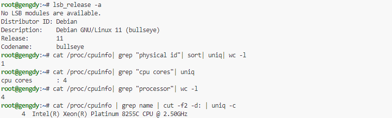
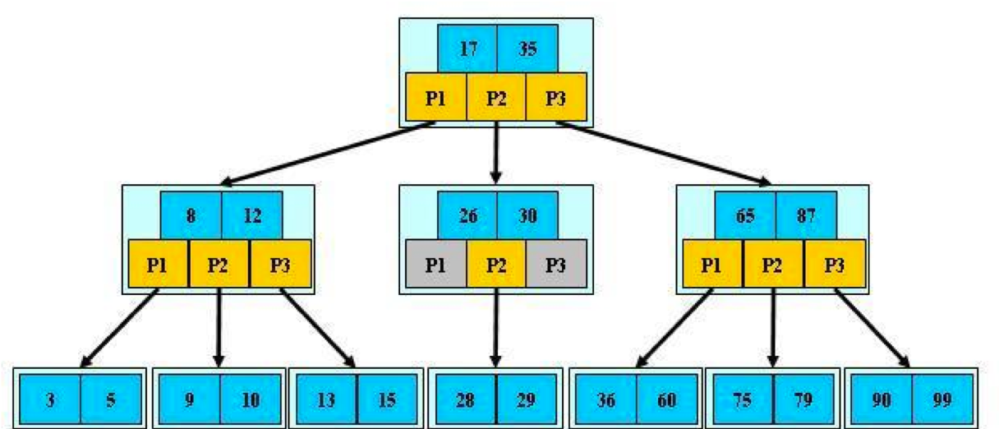
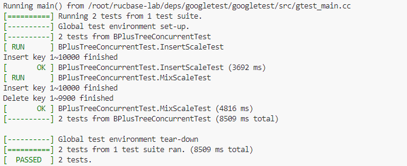
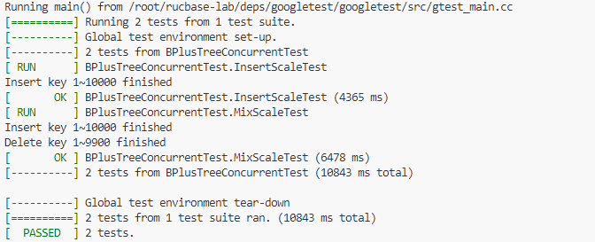
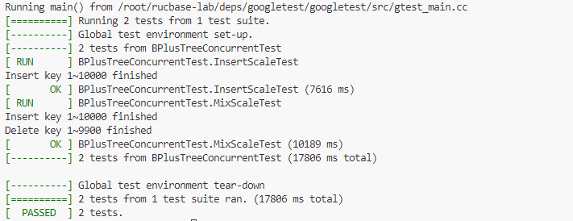
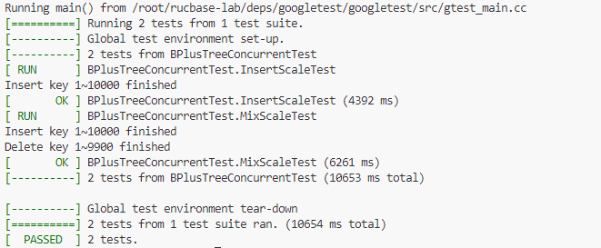
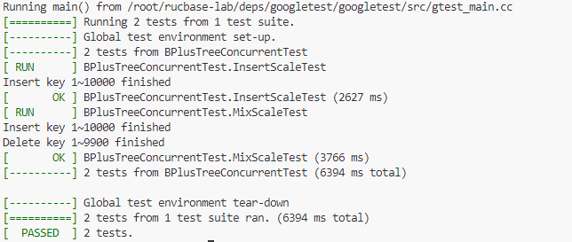

# rucbase-lab实验报告

## 一、前言

​	Rucbase是一个精简的RDBMS原型系统，用于《数据库系统实现》课程的实验教学。本实验框架源码参考和借鉴了CMU15-445课程的[BusTub](https://github.com/cmu-db/bustub) 和Standford CS346课程的[Redbase](https://web.stanford.edu/class/cs346/2015/redbase.html)。

​	我在完成该实验的基础之上，重点总结了期末大作业 task1 和 task2 的实现思路，并分析了 task1 的性能优化可行路径，最终给予这项实验一定的反馈和思考。

> 本报告所有的实验测试结果，均在如下环境中进行：

## 二、实现思路

### 1. task1的实现

#### 1.1 B+树

​	B+树是1970年`Rudolf Bayer`教授在`《Organization and Maintenance of Large Ordered Indices》`一文中提出的[1]。它采用多叉树结构，降低了索引结构的深度，避免传统二叉树结构中绝大部分的随机访问操作，从而有效减少了磁盘磁头的寻道次数，降低了外存访问延迟对性能的影响。它保证树节点中键值对的有序性，从而控制search/insert/delete/update操作的时间复杂度在`O(log(n))`的范围内。鉴于上述优势，B+树作为索引结构的构建模块，被广泛应用在大量数据库系统和存储系统中，其中就包括MySQL。



#### 1.2 B+树并发控制机制基本要求

* `正确的读操作`：
    * `R.1`：不会读到一个处于中间状态的键值对：读操作访问中的键值对正在被另一个写操作修改
    * `R.2`：不会找不到一个存在的键值对：读操作正在访问某个树节点，这个树节点上的键值对同时被另一个写操作（分裂/合并操作）移动到另一个树节点，导致读操作没有找到目标键值对
* `正确的写操作`：
    * `W.1`：两个写操作不会同时修改同一个键值对
* `无死锁`：
    * `D.1`：不会出现死锁：两个或多个线程发生永久堵塞（等待），每个线程都在等待被其他线程占用并堵塞了的资源

#### 1.3 蟹行协议实现

​	在粗粒度的实现中，我们对整个树加锁，即让查找、插入、删除三者操作互斥。显然，这种做法在高并发场景下会导致糟糕的多线程扩展性。是否存在一种并发机制，**它只锁住B+树中被修改的分支，而不是锁住整个树结构**呢？答案是肯定的，`《B-trees in a system with multiple users》`在1976年就已经提出了一种可行的方案[2]。

​	读操作的实现：读操作从根节点出发，首先持有根节点的S锁（`step1-2`）。在（`step3-7`）的过程中，读操作先获得子节点的S锁，再释放父节点的S锁，这个过程反复执行直到找到某个叶节点。最后，它在读取叶节点的内容（`step8`）后释放了叶节点的S锁（`step9`）。因为读操作在持有子节点的锁后才释放父节点的锁，所以不会读到一个正在修改的树节点，不会在定位到某个子节点后子节点的键值对被移动到其它节点，因此能满足R.1/R.2的正确性要求。

```C++
	current  <=  root
    SL (current)
    while  current  is  not  leaf  do  {
        	SL (current->son)
        	SU (current)
        	current  <=  current->son
    }
	Read  the  leaf  node
    SU (current)
```

​	写操作的实现：写操作同样从根节点出发，首先持有根节点的X锁（`step1-2`）。在`step3`到`step9`的过程中，写操作先获得子节点的X锁，然后判断子节点是否是一个安全节点（**安全结点的定义是：结点插入一个键值对后仍然未满(size+1<max_size)；或者结点删除一个键值对后仍然超过或等于半满(size-1>=min_size)。即会引起该节点的分裂/合并等修改树结构的操作**）。如果子节点是安全节点，写操作立即释放祖先节点（可能包含多个节点）的X锁，否则就会暂时保持父节点的锁，这个过程反复执行直到找到某个叶节点。当到达了叶节点后，写操作就已经持有了修改分支上所有树节点的X锁，从而避免其它读/写操作访问该分支，满足W.1的正确性要求。最后，它在修改这个分支的内容（`step10`）后释放了分支的锁（`step12`）。

```C++
	current  <=  root
    XL (current)
    while  current  is  not  leaf  do  {
        	XL (current->son)
            current  <=  current->son
            if  current  is  safe  do  {
                	XU (locked  ancestors)
            }
    }
	Modify  the  leaf  and  upper  nodes
    XU (current)  and  XU (locked ancestors)
```

​	避免死锁：以上算法均采用的是“从上到下”的加锁顺序，满足D.1的正确性要求

> Thread 1:
>
> ​	lock A
>
> ​	lock B
>
> Thread 2:
>
> ​	lock B
>
> ​	lock A
>
> 当 Thread 1 持有 A，等待 B；Thead 2 持有 B，等待 A，产生死锁

​	具体代码实现：（这里不再列举所有代码水字数，只说明一下实现的细节点）

* 代码实现中将 while 循环查找叶子节点单独作为一个函数`FindLeafPage`，需要注意的就是在`insert_enrty`和`delete_entry`中都在进入该循环之前已经`root_latch_.lock()` ，所以在进入`FindLeafPage` 函数时，并不需要对当前节点上锁，只有``find`操作需要上锁`cur_node->page->RLatch()`。
* 在判断该叶子节点是否安全时，需要注意根结点的min_size=2，其余结点的min_size=max_size/2。`min_size = cur_node->IsRootPage() ? 2 : cur_node->GetMinSize();`
* 写操作（`insert` 和`delete`）需要使用`transaction`的`page_set_`来存储从根节点到当前节点经过的被加锁的节点
* 当写操作向下查找过程中，如果当前节点安全，则需要清空`page_set_`中保存的**祖宗节点**，释放其持有锁，并且解锁根节点并**设置返回值**
* 由于安全时需要**清空祖宗节点，并不包括当前节点**，所以我们可以在判断安全性之前将当前节点加锁，但是不放入`page_set_`中，等到safe部分执行完再加入`page_set_`
* `FindLeafPage`函数返回值是为了保证`root_latch`能够顺利释放（因为在`FindLeafPage`函数中并不一定会释放）

### 1.2 task2的实现及优化

> task2提交的代码中已经写好测试脚本，sql 放在 execution/input_task_order.sql，正确结果放在 execution/res_task_order_output.txt，只需要执行脚本 execution/task_order_test.sh

​	task2任务相对而言简单一点，重点是以下两点：

* 构建语法树，增加`order by ... limit ...`语句

    >S -> R C
    >
    >C -> A B
    >
    >A -> ORDER_BY D | ε
    >
    >B -> LIMIT b | ε
    >
    >D -> D , d | d
    >
    >b -> int
    >
    >d -> string

* 排序，重要信息是排序字段和排序类型（Asc | Desc），~~引入`std::sort`函数并定义好排序规则即可~~。

    在师兄指点之下，我又重新思考了这个实验，发现`limit n`这个重要影响因素。

    * 如果排序取的结果 n 很小，并且小于`sort buffer`，使用**优先队列进行堆排序**（即`TopK`问题），时间复杂度能降低到`O(n log(k))`
    * 如果排序取的结果 n 很大，由于堆排序大量的**随机存取数据**，而快排大量的**顺序存取数据**，快排要优于堆排序。在MySQL源码中也声明了快速排序速度是堆排序的 3 倍。

    > 1. 当然，如果参与排序的数据`sort buffer`装不下，应该分批次进行内存快排，最终使用归并排序。
    >
    > 2. MySQL会根据数据量大小切换排序算法，相关函数为`check_if_pq_allplicable`
    > 3. 注意堆排序是**不稳定**的算法，排序项值相同的记录，在排序前后的相对位置可能发生变化

​	综合考虑之下，我仍觉得快排更适合本实验的实现。

## 三、性能优化

​	在本次实验中，通过之前实验的基础和不停的实践，我总结了如下三个影响task1性能的因素。

* 加锁开销和锁冲突
* 缓冲池管理
* 代码逻辑

### 1. 加锁开销和锁冲突

​	加锁过于简单粗暴（粗粒度），会让本来可以并行执行的程序性能下降；加锁太过精细复杂（细粒度），又增加锁操作的时间和空间开销，仍然会影响性能。想要提高性能，就需要在加锁的开销和锁冲突之间 **trade off**

* 粗粒度加锁（即lab2实现的方案）

    

* 细粒度加锁（本次实验，还未进行任何优化）

    

### 2. 缓冲池管理

​	这一点影响性能是显然的，这里不再赘述。通过之前的实验（主要是`buffer_pool`），这里重点说明三点：

#### 2.1 缓冲池的替换策略

​	在lab1中我们实现了两种替换策略，通过调整`config.h`文件中的`REPLACER_TYPE`来选择。

* LRU

    

* CLOCK

    

#### 2.2 缓冲池写回策略

​	在我们实现的`buffer_pool`中，淘汰脏页之前，都要将脏页写回磁盘。这一操作显然很耗时，所以一个简单的想法就是，将`page`继续留在`buffer_pool`中（当然这一操作取决于缓冲池大小），如下为测试数据



#### 2.3 缓冲池大小

​	显然，当缓冲池足够大的时候，我们不再将写回磁盘，节省大量时间，测试请参考`2.2 缓冲池写回策略`。

### 3. 代码逻辑

​	这部分较之前两点并不是很关键，不过仍能一定程度提高程序性能。这里主要参考`《Computer Systems: A Programmer's Perspective》Chapter 5: Optimizing Program Performance`

* 使用``inline`来减少`function call`的开销（本人直接不再声明任何辅助函数）
* 。。。。。。（其余不再说明）

## 四、反馈与思考

### 1. 收获

​	正如开学第一节课陈红老师所讲，全国高校培养的学生在数据库方面大多数并不能很好的满足企业等的要求，普遍停留在 SQL 上，而缺乏对数据库的全面而深刻的认识。在本课程结束时，我并不能说对数据库有了深刻认识，但至少算是初窥门径。

​	回顾全部四次实验，lab1主要实现缓存池管理，lab2主要实现索引管理，lab3主要实现查询执行，lab4主要实现并发控制。

* 缓冲池实验对我而言很有挑战性，在实现后对于 DBMS 如何管理内存与磁盘间的数据交换有了较为清晰的认识，同时这对我理解操作系统的存储管理也有很大的帮助。
* 索引实验重点是在B+树的实现，了解到了数据结构之于索引，索引之于 DBMS 的重要性。对于索引的研究可能对于提高数据库性能有着重要作用，这次实验只是认识索引的第一课。
* 查询实验很有意思，在我初次接触 SQL 的时候，最疑惑的就是他们的执行顺序，例如`group by`和`order by`，在本次实验中尽管没有实现`group by`语句，但仍对于我理解 SQL 语句的执行有很大帮助，特别是 `task2` 实验，尽管较为容易，但是从修改语法树开始，再到执行`order by`语句，对于这个流程有了很清晰的认识。
* 并发实验也很有挑战性，而且我觉得相较于前几次实验可能更为重要。数据库简单理解为数据的集合，一个重要特点就是能够被多用户**共享**。如果设计的数据库只能支持同一时间一个用户单独访问，那就显得很可笑了。当前计算机体系结构正在向单芯片上拥有几十甚至上百个核心的众核机器主导的时代迈进。随着核心数量的增加，并发控制问题变得极具挑战性。

### 2. 反馈

​	尽管在这次实验中收获颇丰，但对于平时作业和期末大作业仍有一些问题需要反馈。

* 第一次实验的第一个小实验是`disk manager`，尽管通过后面实验认识到这项任务确实是合理和必须的，但是当时第一次上机还是有点丈二和尚摸不着头脑，从 SQL 到 page，跨度着实有点大。建议在这一实验可以联系一下后面的`record`存储，而不是笼统地说”数据在磁盘文件中是按照页面（Page）形式组织的“（这句话和”数据在计算机中以01存储“感觉没啥区别，都很抽象）
* 第四次实验的测试数据有点水，后面感觉可以加强一下。
* task2可以增加`group by`，感觉这个实现也很有意思。

----

​	期末大作业task1，我个人认为是一次很好的实验。相较于粗粒度暴力直接地加锁，细粒度加锁让我对锁和并发有了更好的认识。而且通过粗粒度加锁和细粒度加锁，我对于加锁的开销有了更直观的认识（并不见得细粒度减少了冲突就一定能够提高性能）

​	但是由于性能分，事情开始向着奇怪的方向发展了。通过和同学的交流，我发现对于加锁本身优化的可能性和收获并不成正比（例如将悲观锁改成乐观锁可能反而导致性能下降或者提升不大），根据**阿姆达尔定律**，我更倾向于使用手段去提高性能，具体操作可参照报告第三部分。所以我的建议是：在以后课程中不设置这一个性能分，或者限定代码修改范围。

​	期望人大数据库课程越来越好！！！

##  引用

* [1] Bayer R, Mccreight E. Organization and maintenance of large ordered indices[C]// ACM Sigfidet. ACM, 1970:107-141.
* [2] Samadi B. B-trees in a system with multiple users ☆[J]. Information Processing Letters, 1976, 5(4):107-112.
